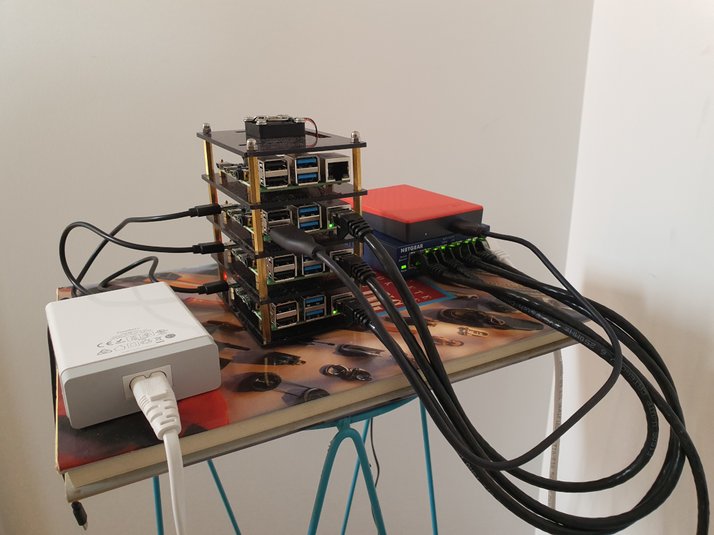

# Hardware List

| Component |  Description |
|:-----|:------|
| [4xRaspberry Pi 4, 4GB](https://www.umart.com.au/Raspberry-Pi-4-Model-B-4GB-Single-Board-Computer_52106G.html) | 1CPU but is quad core. Runs ARM v8 which is the instruction set. In `dpkg` terms, it's arm64. |
| [4x32GB Sandisk Ultra](https://www.umart.com.au/Sandisk-Ultra-32GB-98MB-s-A1-C10-MicroSDHC-Card_55496G.html) | SD Card slot is the default boot device, so these are running Ubuntu Server 20.04 64-bit. |
| [USB SD Card Reader](https://www.jaycar.com.au/usb-micro-sd-card-reader/p/XC4740)  | These are EXCELLENT. You slide the SD Card into the USB key, then use it like a USB key. They cost $5.   But I broke a SD card by forcing it in. The cards slot it on an awkward starting angle, sort of diagonal then straighten up. So don't force then in with a flat edge :/. |
| [Netgear 5-port gigabit switch](https://www.umart.com.au/Netgear-GS105-5-Port-Gigabit-switch_5604G.html) | This provides ethernet connectivity to the Pis.   They each get 1Gbps bandwidth, but I can't think of a workload that would require that.  Wi-fi would have been enough.   I use 50cm CAT6 patch cables to connect to the Pis |  
| [Raspberry Pi case](https://www.amazon.com.au/gp/product/B07MW24S61/ref=ppx_od_dt_b_asin_title_s00?ie=UTF8&psc=1) | This is the tower where the Pis live |
| [Power supply](https://www.amazon.com.au/gp/product/B07MW24S61/ref=ppx_od_dt_b_asin_title_s00?ie=UTF8&psc=1) | Comes with 6 USB-C slots. I use 25cm USB-C cables. |

__Front__

__Back__
