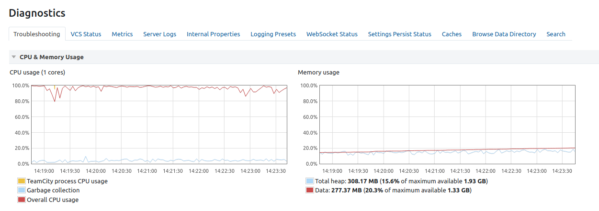

# Running TeamCity Server on a Pi
I forked https://github.com/JetBrains/teamcity-docker-images, and added support for ARM
https://github.com/DylanMunyard/teamcity-docker-images/commit/7e9a718598793a5b49e487ca6065182ce743b55f

The only change was to add `openjdk-8-jre` to the `apt-get` list, and to delete
Amazon Corretto JRE from the Dockerfile. The AWS JRE doesn't support ARM architectures yet. 

Clone `https://github.com/DylanMunyard/teamcity-docker-images.git`

Run the following commands from the cloned repo
- `git checkout arm64`
- `curl -o teamcity.tar.gz https://download-cf.jetbrains.com/teamcity/TeamCity-2020.2.2.tar.gz && tar xvzf teamcity.tar.gz -C context && rm -f teamcity.tar.gz`
- `./generate.sh`

This places a ready to build Dockerfile under 
`generated/linux/Server/Ubuntu/20.04-openjdk`

Then use `buildx` to build it for Arm \
```bash
docker buildx build \
    -f "generated/linux/Server/Ubuntu/20.04-openjdk/Dockerfile" \
    --platform linux/arm64 \
    -t dylanmunyard/teamcity-server:arm.01 "context" \
    --load
```

Push the image:
`docker push dylanmunyard/teamcity-server:arm.01`

## Build the agent
```bash
# build the base agent image first
docker buildx build \
    -f "generated/linux/MinimalAgent/Ubuntu/20.04-openjdk/Dockerfile" \
    --platform linux/arm64 \
    -t teamcity-minimal-agent-openjdk:local-linux "context" \
    --load
    
# tag and push it - this is only because docker buildx can't find local images
docker tag teamcity-minimal-agent-openjdk:local-linux dylanmunyard/teamcity-agent:arm.01 
docker push dylanmunyard/teamcity-agent:arm.01

# then build the full agent image
# to make it work for arm we override the following build args:
# teamcityMinimalAgentImage=dylanmunyard/teamcity-agent-minimal:arm.01
# dotnetLinuxComponent=https://dotnetcli.blob.core.windows.net/dotnet/Sdk/3.1.405/dotnet-sdk-3.1.405-linux-arm64.tar.gz
# dotnetLinuxComponentSHA512=1c7ca36af74524fa5ec49374983338ab3f1584a03aec11080943cf3bbc7e1fb36abf313549231e5be1c58c2252f27d4e001cac1464ee20702daf831ec61c92cf
# the dotnetLinuxComponent arguments are taken from the downloads page https://dotnetcli.blob.core.windows.net/dotnet/Sdk/3.1.405/dotnet-sdk-3.1.405-linux-arm64.tar.gz
docker buildx build \
    -f "generated/linux/Agent/Ubuntu/20.04/Dockerfile" \
    --platform linux/arm64 \
    -t dylanmunyard/teamcity-agent:arm.01 \
    --build-arg teamcityMinimalAgentImage=dylanmunyard/teamcity-agent-minimal:arm.01 \
    --build-arg dotnetLinuxComponent=https://dotnetcli.blob.core.windows.net/dotnet/Sdk/3.1.405/dotnet-sdk-3.1.405-linux-arm64.tar.gz \
    --build-arg dotnetLinuxComponentSHA512=1c7ca36af74524fa5ec49374983338ab3f1584a03aec11080943cf3bbc7e1fb36abf313549231e5be1c58c2252f27d4e001cac1464ee20702daf831ec61c92cf \
    --load "context"
```

Push the image:
`docker push dylanmunyard/teamcity-agent:arm.01`

## Configure server
- Choose MySQL as the database provider. Download the JDBC driver as instructed.
- Enter `my-sql.my-sql.svc.cluster.local:18888` as the connection string
- Enter `teamcity-server`. Needs to be a blank database created beforehand.

## Configure the agent pool 
Select the Kubernetes agent profile type. In the agent popup, choose 'Custom Pod Specification' and
enter: 
```yaml
apiVersion: v1
kind: Pod
metadata:
  name: jetbrains-teamcity-agent
  namespace: teamcity-agent
spec:
  containers:
  - name: jetbrains-teamcity-agent
    image: dylanmunyard/teamcity-agent:arm.2020.2.2
    env:
      - name: "DOCKER_IN_DOCKER"
        value: "start"
    securityContext:
      privileged: true
  nodeSelector:
    kubernetes.io/os: linux
```

## Observations
I think Java uses JIT, because for the first few minutes TC is using up
all four cores at 100%. 



But after clicking around, it reduces to about 1.5Mi (1 and a half cores)